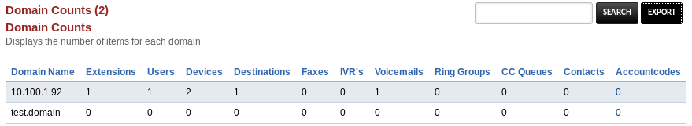

# Domain Counts

Totals up the number of configured extensions, voicemail boxes, ring groups and the like, with the ability to export all this data to a CSV so you can open it in your favorite spreadsheet software!



## Installation
This was tested with FusionPBX 4.5.1 (current master at time of writing) and will likely work on newer or slightly older versions of FusionPBX.

Clone the FusionPBX-Apps repo into the working path after SSHing/Moshing into your server:

```
git clone https://github.com/fusionpbx/fusionpbx-apps.git
cd /var/www/fusionpbx/app
cp -r ~/fusionpbx-apps/domain_counts .
```

Then navigate to your FusionPBX install and choose Advanced => Upgrade, check Menu Defaults and press Execute.

At this point, Status => Domain Statistics should appear after you log out and log back in.
